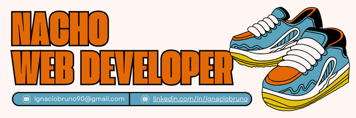

<picture>
 <source media="(prefers-color-scheme: dark)" srcset="nachoHeader.png">
 <source media="(prefers-color-scheme: light)" srcset="nachoHeader.png">
 
</picture>

## Proyectos

### [Rocio Ricagno Web](https://rocioricagno.ar/)
  Pagina web de artísta desarrollada con React.js y Bootstrap
  
  
### [Repositorio Archivo CASLA](http://repositorio.archivocasla.com.ar/)
  Repositorio digital de revistas y folletos del Club Atlético San Lorenzo de Almagro, desarrollado a partir del software libre Omeka.

### [Índice Político Archivo CASLA](http://indice.archivocasla.com.ar/vocab/index.php)
Índice político con apellidos y nombres de personas que tuvieron cargos políticos en el Club Atlético San Lorenzo de Almagro. Su desarrollo se trabajó con el software libre Tematres.
<!--
**i-bruno/i-bruno** is a ✨ _special_ ✨ repository because its `README.md` (this file) appears on your GitHub profile.

Here are some ideas to get you started:

- 🔭 I’m currently working on ...
- 🌱 I’m currently learning ...
- 👯 I’m looking to collaborate on ...
- 🤔 I’m looking for help with ...
- 💬 Ask me about ...
- 📫 How to reach me: ...
- 😄 Pronouns: ...
- ⚡ Fun fact: ...
-->

